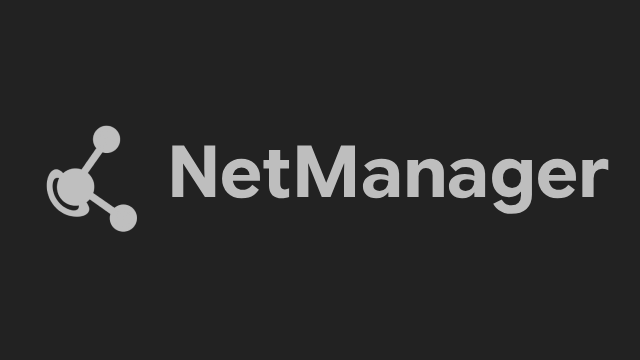
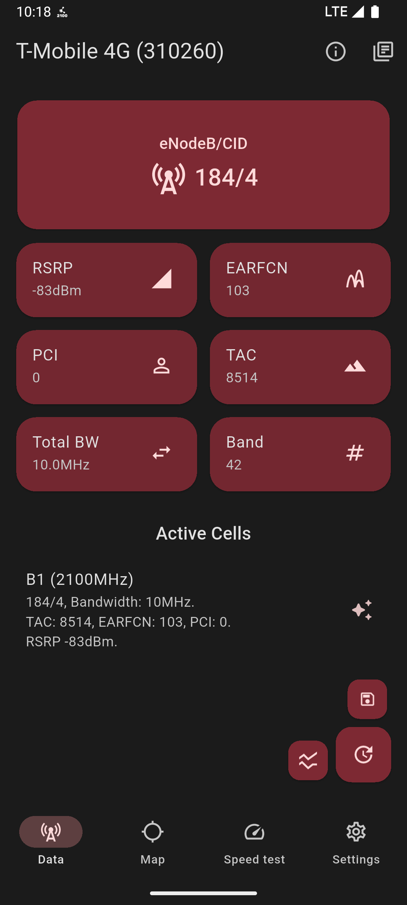
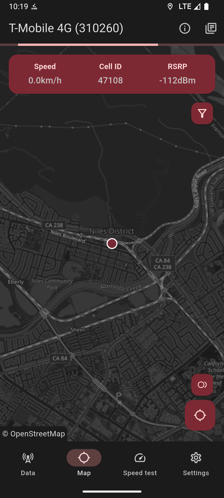
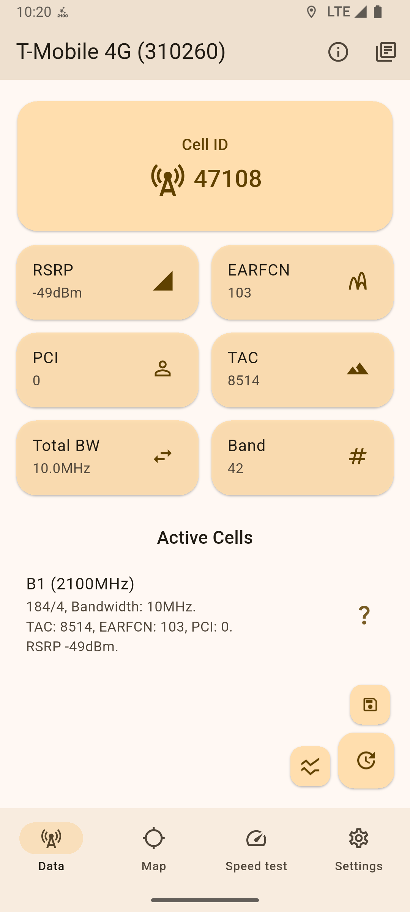
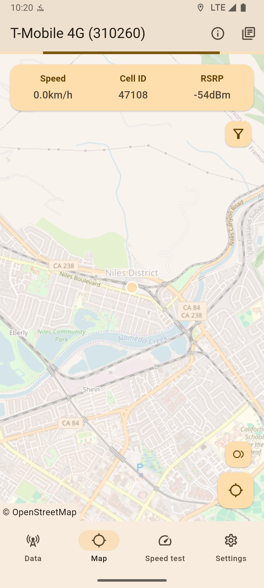

# NetManager


A Material UI mobile network monitoring app built with ease-of-use and speed in mind.

NetManager aims to be a powerful FOSS tool for everyday users, enthusiasts and professionals to gather mobile cell data in a simple, yet precise way.

Built from scratch with Flutter, NetManager respects Material guidelines for user interfaces to seamlessly blend in with system applications.

[](https://gnu.org)
[](https://android.com)
[](https://wearos.google.com)
[](https://flutter.dev)

## Downloads and builds
Official stable and pre-release builds are available in the [Releases](https://github.com/DottoXD/NetManager/releases) tab on GitHub.

Development builds are available at [GitHub Actions](https://github.com/DottoXD/NetManager/actions).
NetManager will be released on other platforms & stores soon.

## Features
NetManager cleanly displays key network metrics across all cellular technologies up to 5G NR. 

The app allows users to import custom cell databases (`.ntm` and `.clf` v3 formats) to enrich the information displayed across various screens.

A sleek map page powered by [OpenStreetMap](https://www.openstreetmap.org/) displays the user's location and maps nearby active cell towers from the current mobile network, if a database is imported; through this interface, users can also record radio signal strength, network usability and network info during trips (drive tests) and replay them later both inside the app or outside (e.g on Google Earth with the built in `.kml`/`.csv` conversion feature!).
The map backend is fully customisable, allowing users to switch if preferred.

Additionally, NetManager includes a built-in network speed test utility with custom backend servers ([LibreSpeed](https://github.com/librespeed/speedtest), OpenSpeedTest and custom backends are supported). 

For advanced monitoring, the app provides a detailed event log capturing real-time network changes, such as cell handoffs and frequency band adjustments. Users can also opt-in to receive system notifications at the occurrency of their selected network events.

To ensure uninterrupted tracking, an optional background service handles all network event and trip logging even when the app is closed, keeping you informed via a status notification displaying the main live network metrics.

NetManager also allows you to open the main Android field testing menus (Android phone information menu, Samsung ServiceMode, MTK Engineer mode, Huawei ProjectMenu, MIUI BandMode) without complicated dialer combinations.

Full dual SIM support is also included, allowing seamless, concurrent data monitoring for multiple SIM cards on the same device.

NetManager also includes various data preprocessing/postprocessing algorithms that filter out bad data exposed by Android's Telephony API, gather extra data from additional APIs and merge all pieces of information from all data sources into a single SIM data object.

All major data sources, such as the event log or the map trip logs, are fully exportable in text files.

## Supported platforms
NetManager currently has stable support for Android 7+ (SDK ver. 24).

A dedicated companion Wear OS app is also available with the "Play Services" flavor of NetManager.

iOS support is currently being evaluated, although it misses the necessary APIs to reliably retrieve cell data.

Upcoming releases prior to version 1.0.0 plan to introduce support for Android auto (companion), Linux (mobile) and rooted Android devices (for raw diagnostic data; NetManager already works normally on rooted devices).

## Data accuracy
NetManager provides accurate and up-to-date data on a wide range of devices by filtering out invalid cell info returned by Android's Telephony service.

Additional advanced workarounds are applied on certain devices to gather extra cell data or to remove invalid info seamlessly.

## Analytics
NetManager might collect anonymous analytic data (opt-in) such as crash dumps and error logs.

All data is non-linkable to the user and is collected with the open source [Sentry Dart SDK](https://github.com/getsentry/sentry-dart) and stored on Bugsink, an EU managed open source Sentry alternative.

## Comparison
*NetManager is not affiliated with or endorsed by the applications listed.*

*Feature availability may vary by device, Android version, modem, carrier, and required permissions.*

Comparison based on publicly documented features as of August 2026.

| Feature / App  | NetManager | NetMonster | Network Signal Guru | G-Mon Pro | Network Cell Info Lite |
| ------------- | ------------- | ------------- | ------------- | ------------- | ------------- |
| 5G SA/NSA support | ✔️ | ✔️ | ✔️ | ✔️ | ✔️ |
| Serving/neighbor cells data | ✔️ | ✔️ | ✔️ | ✔️ | ✔️ |
| Carrier aggregation data | ✔️ | ✔️ | ✔️ | ✔️ | ❌ |
| Data graphs | ✔️ | ✔️ | ✔️ | ❌ | ✔️ |
| Built in speed test | ✔️ | ❌ | ❗ (Through scripts) | ❌ | ✔️ |
| Importable cell databases | ✔️ | ✔️ | ✔️ | ✔️ | ❌ |
| Drive test recording | ✔️ | ✔️ | ✔️ | ✔️ | ✔️ |
| Shortcuts to Android testing menus | ✔️ | ✔️ | ❌ | ✔️ | ❌ |
| Multi-source data aggregation | ✔️ | ✔️ | ✔️ | ✔️ | ✔️ |
| Advanced Android API data postprocessing | ✔️ | ✔️ | - (Does not use Telephony APIs, no need of postprocessing)| ✔️ | ✔️ |
| Event/cell logging | ✔️ | ✔️ | ✔️ | ✔️ | ✔️ |
| Shizuku (shell) support for extra data/features | - (Planned) | ❌ | ❌ | ❌ | ❌ |
| Advanced diag (root) data | - (Planned) | ❌ | ✔️ | ❌ | ❌ |
| Open source | ✔️ | ❗ (Only NetMonster Core) | ❌ | ❌ | ❌ |
| Fully free | ✔️ | ❗ (Ads) | ❌ | ✔️ | ❗ (Ads) |

## Issues and pull requests
Feel free to open an issue for any question, suggestion or any actual issue (such as the app returning wrong cell data) that you might be facing with NetManager.

Pull requests are highly appreciated as long as they're tested.

## Screenshots
| Dark Home | Dark Map | Light Home | Light Map |
| :-: | :-: | :-: | :-: |
|  |  |  |  |

## License
```
Copyright (C) 2025 - 2026 DottoXD

This program is free software: you can redistribute it and/or modify it under the terms of the GNU General Public License as published by the Free Software Foundation, either version 3 of the License, or (at your option) any later version.

This program is distributed in the hope that it will be useful, but WITHOUT ANY WARRANTY; without even the implied warranty of MERCHANTABILITY or FITNESS FOR A PARTICULAR PURPOSE.  See the GNU General Public License for more details.
You should have received a copy of the GNU General Public License along with this program.  If not, see <https://www.gnu.org/licenses/>.
```
